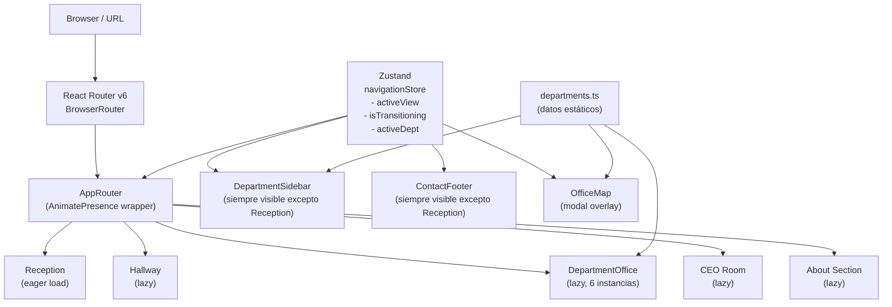

# Diseño Técnico — Zapata Composiciones Virtual Office

## Resumen de investigación

La experiencia de oficina virtual requiere un stack liviano orientado a rendimiento y animaciones fluidas. Los hallazgos clave de la investigación son:

- **Motion (ex Framer Motion)** es la librería de animación estándar para React SPAs. En 2025 pasó a llamarse `motion` con import `motion/react`. Provee `AnimatePresence` para animaciones de salida de componentes y control de timing declarativo, ideal para transiciones de ≤600ms.
- **React Router v6** gestiona el historial del navegador con `useNavigate` y la History API nativa. El soporte de deep-linking directo a rutas específicas es nativo con `BrowserRouter`.
- **Zustand** es la solución de estado global más ligera para React (~1KB). Adecuada para gestionar el estado de navegación (transición en curso, departamento activo, mapa abierto) sin boilerplate de Redux.
- **CSS 3D perspective** (`transform-style: preserve-3d`, `perspective`) logra el efecto de pasillo con profundidad sin necesidad de Three.js, manteniendo rendimiento alto y accesibilidad.
- **Vite + React + TypeScript** con `React.lazy` + `Suspense` permite code-splitting por vista, reduciendo el bundle inicial para cumplir el objetivo de carga <3s.
- Los reproductores de audio se implementan con el elemento HTML5 `<audio>` encapsulado en un componente React accesible, con soporte MP3/OGG para cobertura cross-browser.

---

## Overview

La **Zapata Composiciones Virtual Office** es una Single Page Application (SPA) que simula el recorrido físico por una empresa musical real. El visitante entra por una recepción, atraviesa un pasillo con seis puertas numeradas y accede al interior de cada departamento. La navegación ocurre completamente en el cliente — sin recargas de página — con transiciones animadas que refuerzan la metáfora espacial.

El objetivo técnico central es crear una experiencia inmersiva, performante y accesible que funcione en dispositivos desde 320px de ancho, cumpla WCAG 2.1 nivel AA y cargue en menos de 3 segundos.

---

## Architecture

### Stack Tecnológico

| Capa | Tecnología | Justificación |
|------|------------|---------------|
| Framework UI | React 18 + TypeScript | Tipado estático, ecosistema maduro, `React.lazy` para code-splitting |
| Bundler | Vite 5 | HMR rápido, tree-shaking eficiente, chunks automáticos por import dinámico |
| Routing | React Router v6 | History API nativa, deep-linking, `useNavigate` para navegación programática |
| Animaciones | Motion (`motion/react`) | AnimatePresence para exit animations, control declarativo de timing ≤600ms |
| Estado global | Zustand | Gestión liviana del estado de transición, departamento activo y bloqueo de navegación |
| Estilos | CSS Modules + CSS Custom Properties | Scoping de estilos por componente, tokens de diseño globales (colores, fuentes) |
| Audio | HTML5 `<audio>` nativo + React wrapper | Accesible, cross-browser, sin dependencias externas |
| Testing | Vitest + React Testing Library + fast-check | Unit tests, property-based tests, sin configuración adicional sobre Vite |

### Estructura de Directorios

```
src/
├── components/           # Componentes UI reutilizables
│   ├── AudioPlayer/
│   ├── DepartmentSidebar/
│   ├── ContactFooter/
│   ├── OfficeMap/
│   ├── LoadingScreen/
│   └── NavigationLock/
├── views/                # Vistas principales (lazy-loaded)
│   ├── Reception/
│   ├── Hallway/
│   ├── DepartmentOffice/
│   ├── CEORoom/
│   └── AboutSection/
├── store/                # Zustand stores
│   ├── navigationStore.ts
│   └── audioStore.ts
├── data/                 # Datos estáticos por departamento
│   └── departments.ts
├── hooks/                # Custom hooks
│   ├── useNavigationLock.ts
│   └── useKeyboardNav.ts
├── styles/               # CSS global y tokens de diseño
│   ├── tokens.css
│   └── global.css
├── router/               # Configuración de React Router
│   └── AppRouter.tsx
└── App.tsx
```

### Diagrama de Arquitectura



### Patrón de Navegación

El flujo de navegación principal sigue este árbol de rutas:

```
/                          → Reception
/hallway                   → Hallway
/department/:slug          → DepartmentOffice (slug: composicion-musical, proyectos-remixes, etc.)
/ceo                       → CEO Room  
/about                     → About Section
```

El `navigationStore` de Zustand actúa como capa de coordinación: cuando se inicia una transición, establece `isTransitioning: true` y bloquea llamadas adicionales a `navigate()` hasta que la animación completa.

---

## Components and Interfaces

### Componentes Principales

#### `AppRouter`
Componente raíz que envuelve las rutas con `AnimatePresence` para habilitar animaciones de salida.

```typescript
interface AppRouterProps {
  // Sin props — lee la ubicación de React Router internamente
}
```

#### `Reception`
Vista de pantalla completa de bienvenida.

```typescript
interface ReceptionProps {
  // Sin props — autónoma
}
```

#### `Hallway`
Vista del pasillo con perspectiva 3D y seis puertas.

```typescript
interface DoorProps {
  departmentId: DepartmentId;   // 1–6
  label: string;                // Nombre del departamento
  number: number;               // Número visible en la puerta
  onClick: () => void;
}
```

#### `DepartmentOffice`
Vista interior de un departamento. Recibe el departamento por parámetro de ruta (`slug`).

```typescript
interface DepartmentOfficeProps {
  // Lee :slug de useParams()
}

// Internamente usa:
interface DepartmentData {
  id: DepartmentId;
  slug: string;
  name: string;
  tagline: string;
  backgroundImage: string;
  services: Service[];
  featuredWorks: FeaturedWork[];
  workProcess: WorkStep[];
  contactAction: ContactAction;
}
```

#### `DepartmentSidebar`
Menú lateral persistente visible en todas las vistas excepto Reception.

```typescript
interface DepartmentSidebarProps {
  activeDepartmentId?: DepartmentId;  // undefined si no se está en un dept
  onNavigate: (id: DepartmentId) => void;
  isMobileCollapsed: boolean;
}
```

#### `AudioPlayer`
Reproductor de audio accesible.

```typescript
interface AudioPlayerProps {
  src: string;
  title: string;
  artist?: string;
  coverImage?: string;
}
```

#### `OfficeMap`
Modal overlay con el plano interactivo.

```typescript
interface OfficeMapProps {
  isOpen: boolean;
  onClose: () => void;
  activeRoomId?: RoomId;  // Para resaltar la sala activa
  onNavigate: (roomId: RoomId) => void;
}

type RoomId = DepartmentId | 'ceo';
```

#### `ContactFooter`
Footer persistente con enlaces de contacto y redes sociales.

```typescript
interface ContactFooterProps {
  // Sin props — usa datos de configuración global
}
```

#### `TransitionWrapper`
Envuelve cada vista para aplicar la animación de entrada/salida con Motion.

```typescript
interface TransitionWrapperProps {
  children: React.ReactNode;
  variant?: 'fade' | 'slide-left' | 'slide-right' | 'zoom-in';
}
```

### Navigation Store (Zustand)

```typescript
interface NavigationState {
  activeView: ViewId;
  activeDepartmentId: DepartmentId | null;
  isTransitioning: boolean;
  isMapOpen: boolean;
  
  navigateTo: (viewId: ViewId, deptId?: DepartmentId) => void;
  startTransition: () => void;
  endTransition: () => void;
  openMap: () => void;
  closeMap: () => void;
}

type ViewId = 'reception' | 'hallway' | 'department' | 'ceo' | 'about';
type DepartmentId = 1 | 2 | 3 | 4 | 5 | 6;
```

### Hooks Personalizados

#### `useNavigationLock`
Previene navegación durante transiciones activas.

```typescript
function useNavigationLock(): {
  navigate: (to: string, options?: NavigateOptions) => void;
  isLocked: boolean;
}
```

#### `useKeyboardNav`
Habilita navegación completa por teclado para elementos interactivos de la oficina.

```typescript
function useKeyboardNav(
  onEnter: () => void,
  onEscape?: () => void
): { onKeyDown: React.KeyboardEventHandler }
```

---

## Data Models

### Modelo de Departamento

```typescript
interface Service {
  id: string;
  name: string;
  description?: string;
}

interface FeaturedWork {
  id: string;
  title: string;
  artist?: string;
  type: 'audio' | 'visual';
  // Para audio:
  audioSrc?: string;
  audioCover?: string;
  // Para visual:
  thumbnailSrc?: string;
  linkUrl?: string;
}

interface WorkStep {
  number: number;
  title: string;
  description: string;
}

interface ContactAction {
  label: string;          // Texto del botón CTA
  type: 'whatsapp' | 'email' | 'form';
  url: string;            // URL destino (abre en nueva pestaña)
}

interface DepartmentData {
  id: DepartmentId;       // 1–6
  slug: string;           // URL slug (ej. "composicion-musical")
  name: string;           // Nombre completo del departamento
  tagline: string;        // Subtítulo corto
  backgroundImage: string;// Imagen ambiental de fondo
  ambientColor: string;   // Color de acento para ese dpto
  services: Service[];    // Mínimo 4 servicios
  featuredWorks: FeaturedWork[];
  workProcess: WorkStep[]; // Mínimo 3 pasos
  contactAction: ContactAction;
}
```

### Tabla de Departamentos

| ID | Slug | Nombre | CTA |
|----|------|--------|-----|
| 1 | `composicion-musical` | Composición Musical | "Solicitar servicio" |
| 2 | `proyectos-remixes` | Proyectos y Remixes | "Enviar demo" |
| 3 | `produccion-musical` | Producción Musical | "Iniciar demo" |
| 4 | `marketing-lanzamientos` | Marketing y Lanzamientos | "Hablemos" |
| 5 | `relaciones-artisticas` | Relaciones Artísticas | "Colaborar" |
| 6 | `derechos-autor` | Derechos de Autor | "Consultar" |

### Modelo de CEO Room

```typescript
interface CEOProfile {
  name: string;              // "Emmanuel Segura Zapata"
  title: string;             // "Fundador y CEO de Zapata Composiciones"
  photo: string;             // URL de foto/ilustración
  welcomeMessage: string;    // Mensaje personal
  signature: string;         // URL de imagen de firma manuscrita
  stats: CEOStat[];
  sections: CEOSection[];    // Mi historia, Misión y visión, Valores, Logros
  whatsappUrl: string;
}

interface CEOStat {
  value: string;             // "+150", "+50", "+30M"
  label: string;             // "canciones creadas", etc.
}

interface CEOSection {
  id: 'historia' | 'mision' | 'valores' | 'logros';
  title: string;
  content: string;
}
```

### Modelo de About Section

```typescript
interface CompanyValue {
  id: string;
  title: string;             // "Profesionalismo", "Creatividad", etc.
  description: string;
  icon: string;              // Nombre del icono SVG
}
```

### Design Tokens (CSS Custom Properties)

```css
:root {
  /* Colores */
  --color-bg-primary: #0A0A0A;
  --color-bg-secondary: #111111;
  --color-accent-gold: #C9A84C;
  --color-accent-gold-light: #E8C96A;
  --color-text-primary: #F0EAD6;
  --color-text-secondary: #9A8C6E;
  --color-border: rgba(201, 168, 76, 0.3);
  
  /* Tipografía */
  --font-display: 'Playfair Display', 'Georgia', serif;
  --font-body: 'Inter', 'Helvetica Neue', sans-serif;
  
  /* Espaciado */
  --sidebar-width: 280px;
  --sidebar-width-collapsed: 56px;
  --footer-height: 64px;
  
  /* Animaciones */
  --transition-duration: 600ms;
  --transition-easing: cubic-bezier(0.25, 0.46, 0.45, 0.94);
  
  /* Sombras de iluminación ambiental */
  --glow-gold: 0 0 30px rgba(201, 168, 76, 0.3);
  --glow-gold-strong: 0 0 60px rgba(201, 168, 76, 0.5);
}
```

---

## Correctness Properties

*Una propiedad es una característica o comportamiento que debe mantenerse verdadero en todas las ejecuciones válidas de un sistema — esencialmente, un enunciado formal sobre lo que el sistema debe hacer. Las propiedades sirven como puente entre especificaciones legibles por humanos y garantías de corrección verificables por máquinas.*

### Property 1: Navegación de puerta a departamento

*Para cualquier* índice de puerta válido (1–6) en el Hallway, al activar esa puerta el sistema SHALL navegar exactamente a la ruta del departamento correspondiente a ese índice.

**Validates: Requirements 2.5**

### Property 2: Navegación del sidebar a departamento

*Para cualquier* ítem de departamento en el DepartmentSidebar (índices 1–6), al activar ese ítem el sistema SHALL navegar exactamente a la ruta del departamento correspondiente, sin pasar por el Hallway.

**Validates: Requirements 3.3**

### Property 3: Sidebar presente en todas las vistas excepto Reception

*Para cualquier* vista del Virtual_Office que no sea la Reception (Hallway, cualquier DepartmentOffice, CEO_Room, About_Section), el DepartmentSidebar SHALL estar presente en el árbol de componentes renderizado.

**Validates: Requirements 3.1**

### Property 4: Ítem activo en el Sidebar coincide con el departamento activo

*Para cualquier* departamento activo (1–6), al renderizar el layout con ese departamento activo, exactamente uno de los ítems del DepartmentSidebar SHALL tener la clase/estilo de activo y SHALL corresponder al departamento correcto.

**Validates: Requirements 3.4**

### Property 5: Cada departamento tiene su vista con encabezado correcto

*Para cualquier* objeto de datos de departamento (de los 6 disponibles), al renderizar DepartmentOffice con esos datos el encabezado principal SHALL contener exactamente el nombre del departamento.

**Validates: Requirements 4.1, 4.2**

### Property 6: Cada departamento incluye sus secciones obligatorias

*Para cualquier* objeto de datos de departamento con datos válidos, al renderizar DepartmentOffice SHALL estar presentes: la sección de servicios con al menos 4 ítems, la sección Featured_Works, la sección Work_Process con al menos 3 pasos, el botón CTA de contacto, y el botón "Volver al pasillo".

**Validates: Requirements 4.3, 4.4, 4.5, 4.6, 4.8**

### Property 7: El CTA de contacto abre la URL correcta en nueva pestaña

*Para cualquier* objeto de datos de departamento con una `contactAction.url` definida, al simular click en el botón CTA SHALL invocarse `window.open` con esa URL exacta y el target `_blank`.

**Validates: Requirements 4.7**

### Property 8: Transiciones completan dentro de 600ms

*Para cualquier* acción de navegación entre vistas, la duración de la transición (suma de exit + enter animation) SHALL ser ≤600ms.

**Validates: Requirements 6.2**

### Property 9: Bloqueo de navegación durante transiciones

*Para cualquier* transición en curso (isTransitioning = true), cualquier llamada adicional a la función de navegación SHALL ser ignorada sin producir cambios en el historial o en la vista activa.

**Validates: Requirements 6.4**

### Property 10: Deep-linking funciona para cualquier ruta de departamento

*Para cualquier* slug de departamento válido, al acceder directamente a la URL `/department/:slug` el sistema SHALL renderizar el DepartmentOffice correcto sin redirigir a Reception.

**Validates: Requirements 6.5**

### Property 11: OfficeMap indica la sala activa correcta

*Para cualquier* vista activa del Virtual_Office, al renderizar el OfficeMap con ese `activeRoomId`, exactamente una sala SHALL tener el estilo de activo y SHALL corresponder a la vista activa.

**Validates: Requirements 7.3**

### Property 12: OfficeMap accesible desde cualquier vista excepto Reception

*Para cualquier* vista que no sea Reception, el control de acceso al OfficeMap SHALL estar presente y ser activable.

**Validates: Requirements 7.4**

### Property 13: Contact Footer presente en todas las vistas excepto Reception

*Para cualquier* vista del Virtual_Office que no sea la Reception, el ContactFooter SHALL estar presente en el árbol de componentes renderizado.

**Validates: Requirements 10.1**

### Property 14: Todos los elementos interactivos son accesibles por teclado

*Para cualquier* elemento interactivo del Virtual_Office (Door, botón, ítem de sidebar, control del mapa), el elemento SHALL tener un `tabIndex` ≥0, un `role` semántico adecuado, y SHALL responder a eventos `Enter` y `Space` del teclado de forma equivalente al click.

**Validates: Requirements 12.2**

### Property 15: Imágenes no decorativas tienen texto alternativo no vacío

*Para cualquier* elemento `` o elemento con `role="img"` que no sea puramente decorativo (no tiene `aria-hidden="true"`), el atributo `alt` SHALL ser una cadena no vacía y descriptiva.

**Validates: Requirements 12.3**

---

## Error Handling

### Ruta no encontrada (404)
Si el visitante accede a una URL que no corresponde a ninguna ruta definida, el sistema renderizará una vista de error estilizada con la estética del Virtual_Office que incluye:
- Mensaje indicando que esa "sala no existe"
- Botón para volver a la Reception
- El DepartmentSidebar visible para acceso directo a departamentos

### Carga fallida de recursos (imágenes, audio)
- **Imágenes**: Cada `` tendrá un handler `onError` que sustituye la imagen rota por un placeholder oscuro con el ícono dorado de Zapata.
- **Audio**: Los `<audio>` tendrán handlers `onError` que muestran un estado de error accesible (`aria-live="polite"`) en el reproductor.

### Navegador sin soporte de animaciones
El sistema detectará `prefers-reduced-motion: reduce` y la ausencia de la API de animaciones CSS mediante feature detection en el módulo de animación. Si no hay soporte:
- Las transiciones se reducen a cambios instantáneos de visibilidad (`opacity: 0 → 1`)
- Todos los departamentos siguen siendo accesibles
- El `TransitionWrapper` exporta variantes de animación `null` como fallback

### Fallo de carga de chunks lazily-loaded
Los imports dinámicos (`React.lazy`) se envuelven en `<ErrorBoundary>` a nivel de `AppRouter`. Si un chunk falla al cargarse (ej. error de red), el ErrorBoundary muestra:
- Mensaje de error con estética del Virtual_Office
- Botón de reintento (`window.location.reload()`)
- No se bloquea el acceso a otras secciones ya cargadas

### Estado de carga multimedia (Req. 12.5)
Durante la carga de imágenes de fondo y audio en `DepartmentOffice`, se muestra un `LoadingScreen` temático (indicador dorado animado sobre fondo negro) usando `React.Suspense` + `useState` para el estado de carga de recursos individuales.

---

## Testing Strategy

### Approach General

Este proyecto usa un enfoque de **doble cobertura**: tests de ejemplo para comportamientos específicos y fijos, y tests de propiedades para comportamientos universales que deben mantenerse para cualquier input válido.

**Librería de property-based testing**: `fast-check` — madura, integrada con Vitest, TypeScript-nativo, y con generadores arbitrarios para primitivos y estructuras personalizadas.

### Configuración

```typescript
// vitest.config.ts
export default {
  test: {
    environment: 'jsdom',
    setupFiles: ['./src/test/setup.ts'],
  }
}
```

Cada property test corre con un mínimo de **100 iteraciones** (`numRuns: 100`).

### Tests de Propiedad (Property-Based Tests)

Cada una de las 15 propiedades del diseño se implementa como un test de propiedad con `fast-check`. El tag de referencia sigue el formato:

```
// Feature: zapata-composiciones-virtual-office, Property {N}: {descripción}
```

**Ejemplo de implementación — Property 1:**
```typescript
// Feature: zapata-composiciones-virtual-office, Property 1: door navigation
it('clicking any door navigates to the correct department route', () => {
  fc.assert(
    fc.property(
      fc.integer({ min: 1, max: 6 }),
      (doorIndex) => {
        const { navigateMock } = renderHallway();
        clickDoor(doorIndex);
        expect(navigateMock).toHaveBeenCalledWith(
          getDepartmentRoute(doorIndex)
        );
      }
    ),
    { numRuns: 100 }
  );
});
```

**Ejemplo — Property 3 (sidebar presente en vistas no-Reception):**
```typescript
// Feature: zapata-composiciones-virtual-office, Property 3: sidebar presence
it('DepartmentSidebar is present in all non-Reception views', () => {
  const nonReceptionViews = fc.constantFrom(
    '/hallway',
    '/department/composicion-musical',
    '/department/produccion-musical',
    '/ceo',
    '/about'
  );
  fc.assert(
    fc.property(nonReceptionViews, (route) => {
      const { container } = renderWithRouter(<App />, { route });
      expect(container.querySelector('[data-testid="dept-sidebar"]')).toBeTruthy();
    }),
    { numRuns: 100 }
  );
});
```

### Tests de Ejemplo (Unit Tests)

- Reception: verifica logo, botón CTA, elemento disc de oro, plantas decorativas
- Hallway: verifica exactamente 6 puertas con nombres correctos
- DepartmentOffice por cada uno de los 6 departamentos: verifica servicios específicos y texto CTA según Req. 5
- CEO_Room: verifica nombre, cargo, estadísticas (+150 canciones, +50 artistas, +30M reproducciones), firma, botón WhatsApp
- About_Section: verifica los 4 valores fundacionales con íconos
- Contact_Footer: verifica 4 redes sociales, WhatsApp, email, copyright
- Navegación: historial del navegador con `navigate(-1)`, volver al pasillo desde departamento

### Tests de Edge Case

- `prefers-reduced-motion: reduce`: verifica que las animaciones se eliminan y el contenido es accesible
- Carga de imágenes fallida: verifica que el placeholder se muestra
- Carga de audio fallida: verifica mensaje de error accesible
- Viewport de 320px: verifica que no hay overflow horizontal

### Tests de Smoke / Performance

- Carga inicial <3s: medido con `performance.now()` en un test de benchmark
- Configuración de rutas: verifica que todas las rutas (`/`, `/hallway`, `/department/*`, `/ceo`, `/about`) están registradas en el router

### Tests de Integración

- Flujo completo Reception → Hallway → DepartmentOffice: verifica la secuencia navegacional completa
- Deep-link directo a `/department/composicion-musical`: verifica renderizado sin pasar por Reception

### Cobertura Objetivo

| Tipo | Objetivo |
|------|---------|
| Líneas | ≥80% |
| Branches | ≥75% |
| Funciones | ≥85% |
| Properties (PBT) | 15 propiedades × 100 iteraciones = 1500 ejecuciones mínimas |
